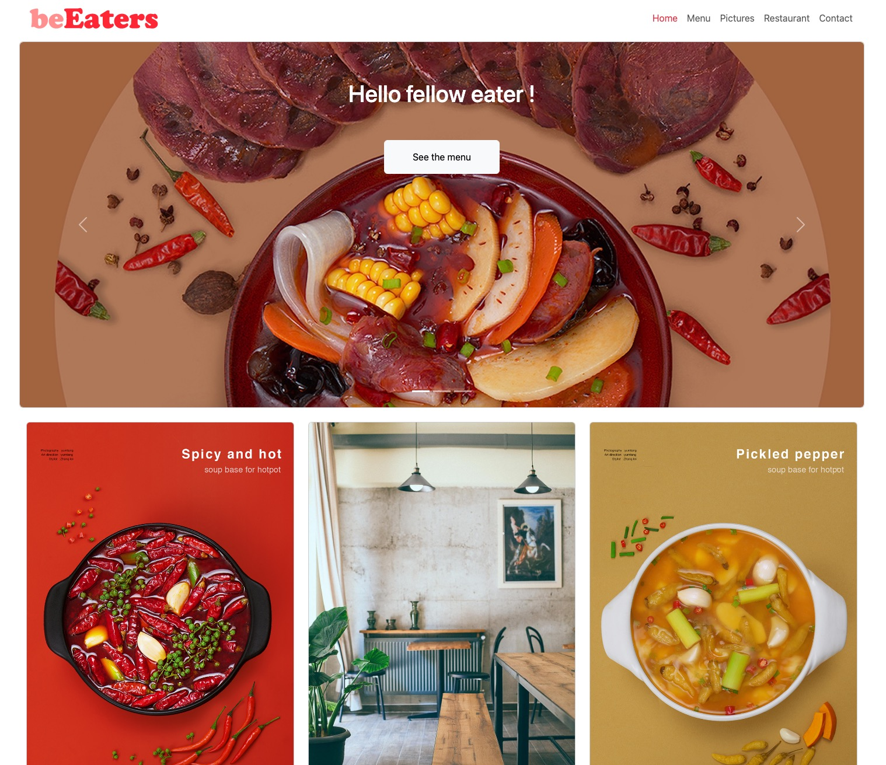
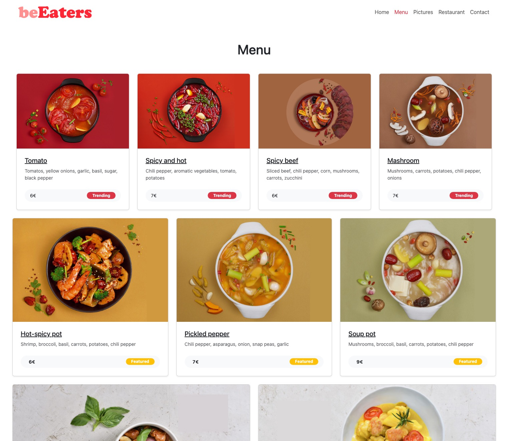

# Be Eaters

BeEaters is a restaurant website using React, Typescript and Bootstrap.




## Installation

Clone the repository:
git clone git@github.com:ronniejamestorres/beeaters-react-bootstrap.git

Follow these steps to run this project in your local environment:

```bash
git clone [your-repo-link]
cd issue-tracker-front
npm install
```

## Usage

After installation, you can start the application with:

```bash
npm start
```

You should now be able to access the application at localhost:

```bash
[your-port-number]
```

## Contributing

Contributions to BeEaters are very welcome! If you have an idea for a feature, or find a bug to fix, please follow these steps:

- Fork this repository.
- Create a branch on your local repository.
- Make your changes on your branch.
- Push your branch to your Github repository.
- Create a Pull Request to merge with this repository.

## Start the development server:

```bash
npm run dev
```
